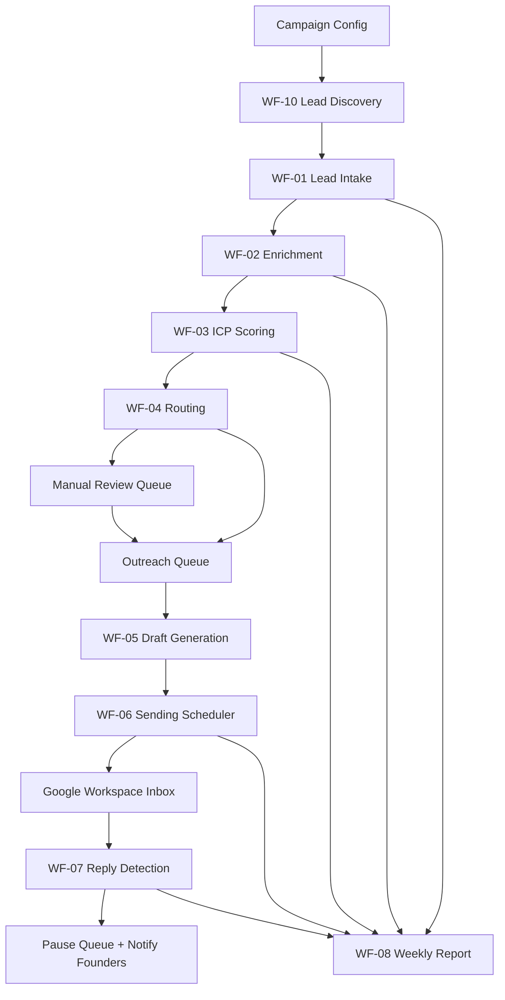

# n8n Workflow Skeleton

This folder is the head-honcho orchestration blueprint for the AI Automation Lead Engine.

n8n is the workflow brain. Supabase remains the source of truth. The codebase owns reusable logic and validation where needed. Google Workspace sends/receives email. DeepSeek produces structured JSON only.

## Workflow Level

Classification: Level 4 multi-system automation orchestration.

Use the fewest moving parts:

- Supabase nodes for direct table reads/writes.
- HTTP Request nodes for app endpoints once they exist.
- Gmail/Google Workspace nodes for send/reply monitoring.
- DeepSeek HTTP Request nodes for scoring, email drafting, and reply classification.
- One Error Trigger workflow for centralized failure logging.
- Google Places is the only MVP discovery provider. Brave Search, SerpAPI, Apify, proxies, paid scraping, and paid lead databases are disabled for MVP.

## Workflow Map

## Required n8n Credentials

Create these in n8n credentials. Do not hardcode secrets inside nodes.

| Credential | Used By | Notes |
|---|---|---|
| Supabase service role | All workflows | Server-side only. Required for inserts/updates. |
| Google Places API key | WF-10 Lead Discovery | Restrict to Places API and VPS/n8n egress IP where possible. |
| DeepSeek API key | Scoring, drafting, reply classification | Use `deepseek-chat`. |
| Google Workspace OAuth | Sending + reply detection | One outreach inbox for MVP. |
| Notification channel | Replies, review alerts, weekly report | Email first; Telegram/Discord optional. |
| App workflow API key | Optional HTTP endpoints | Use `x-n8n-api-key`. |

## Global Workflow Rules

- Every workflow writes a `workflow_events` row on failure.
- Every workflow must be safe to rerun.
- WF-10 must stop at 30 final leads/day, 75 checked candidates/day, 100 Details calls/day, 150 total Places calls/day, and 1 discovery run/day.
- WF-10 must use Text Search IDs-only before Place Details.
- WF-10 must never call Brave Search, SerpAPI, Apify, proxies, paid scraping services, paid lead databases, or generic search fallback in MVP.
- WF-10 must crawl only Google Places `websiteUri` with depth/page/byte/time limits.
- Never send if `app_settings.global_outreach.paused = true`.
- Never send if a `reply_events` row exists for the lead.
- Never send if lead status is `paused`, `replied`, `unsubscribed`, `bounced`, `not_interested`, or `archived`.
- Never send without a prospect email.
- Band A Step 1 requires founder approval.
- Interested replies are never auto-answered.

## Recommended Build Order

1. Configure Supabase, DeepSeek, Gmail, and notification credentials.
2. Build `WF-00 Error Logger`.
3. Build `WF-10 Lead Discovery`.
4. Build `WF-01 Lead Intake`.
5. Build `WF-02 Enrichment`.
6. Build `WF-03 ICP Scoring`.
7. Build `WF-04 Routing`.
8. Build `WF-05 Draft Generation`.
9. Build `WF-06 Sending Scheduler`.
10. Build `WF-07 Reply Detection`.
11. Build `WF-08 Weekly Report`.
12. Run dry test with `global_outreach.paused = true`.

## Files

- `workflows/WF-00-error-logger.md`
- `workflows/WF-01-lead-intake.md`
- `workflows/WF-02-enrichment.md`
- `workflows/WF-03-icp-scoring.md`
- `workflows/WF-04-routing.md`
- `workflows/WF-05-draft-generation.md`
- `workflows/WF-06-sending-scheduler.md`
- `workflows/WF-07-reply-detection.md`
- `workflows/WF-08-weekly-report.md`
- `workflows/WF-09-dry-run-acceptance.md`
- `workflows/WF-10-lead-discovery.md`
